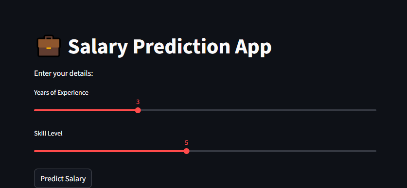

# 💼 AI Salary Prediction Web App (Streamlit)

## 📌 Project Overview

This project is a Machine Learning-based web application built using Python and Streamlit.
It predicts a user's estimated salary based on input features like **experience** and **skill level**.

The goal of this project is to demonstrate how ML models can be deployed as interactive web apps.

---

## 🚀 Features

* Simple and interactive UI using Streamlit
* Real-time prediction
* Lightweight ML model (Linear Regression)
* Easy to use and modify dataset
* Fast deployment

---

## 🛠️ Technologies Used

* Python
* Streamlit
* Pandas
* NumPy
* Scikit-learn

---

## 📊 Dataset

The dataset contains:

* Experience (Years)
* Skills (Level)
* Salary (Target)

Example:

| Experience | Skills | Salary |
| ---------- | ------ | ------ |
| 1          | 2      | 20000  |
| 3          | 4      | 45000  |
| 5          | 6      | 80000  |

---

## ⚙️ Installation & Setup

### Step 1: Clone Repository

```bash
git clone https://github.com/your-username/your-repo-name.git
cd your-repo-name
```

### Step 2: Install Dependencies

```bash
pip install -r requirements.txt
```

### Step 3: Train Model

```bash
python model.py
```

### Step 4: Run Streamlit App

```bash
python -m streamlit run streamlit_app.py
```

---

## 📥 Input Example

User enters:

* Experience: 3 years
* Skills: 5

### 🖼️ Input Screenshot



---

## 📤 Output Example

Predicted Salary:
👉 ₹55,000 (approx)

### 🖼️ Output Screenshot


---

## 📂 Project Structure

```
AIWebPredictionApp/
│── streamlit_app.py
│── model.py
│── salary_data.csv
│── model.pkl
│── requirements.txt
│── images/
│     ├── input.png
│     ├── output.png
```

---

## 📈 Model Used

* Linear Regression

---

## 🔮 Future Improvements

* Add more features (education, location)
* Improve accuracy with advanced models
* Deploy on cloud (Streamlit Cloud / Heroku)
* Add graphs and analytics

---

## 👩‍💻 Author

Your Name

---

## ⭐ Contribute

Feel free to fork this repo and improve it!

---

## 📜 License

This project is open-source and available under the MIT License.
